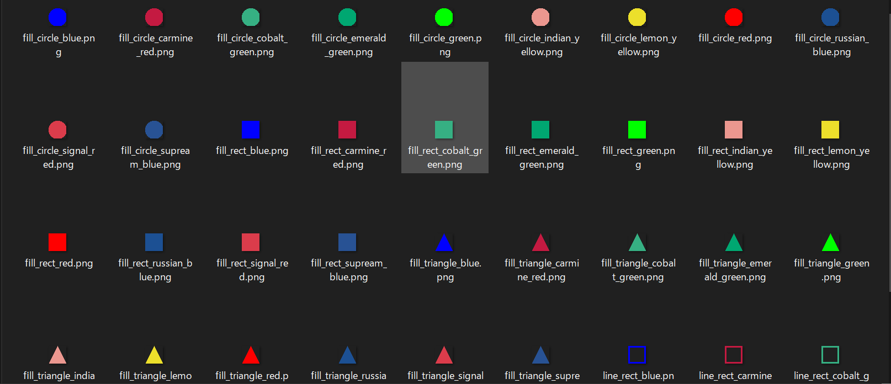

# simple-assets
simple-assets は、プリミティブな図形をいくつかの色で塗りつぶした画像を生成するツールです。  

# install
実際にはこれを実行する必要はありませんが、一応動かし方を載せておきます。  
画像だけならgithubのリリースページから落とせます。
````
cd simple-assets
pip install -r requirements.txt
python app/main.py
````

# sample
以下のような画像を生成します。
